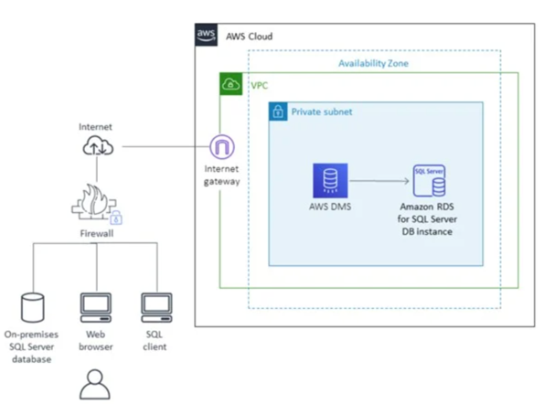

# AWS Database Migration Service

## 定义与概述

AWS Database Migration Service（AWS
DMS）是亚马逊云科技（AWS）提供的一项完全托管服务，旨在帮助用户轻松、高效且安全地将数据库从一个环境迁移到另一个环境。这些环境既可以是不同类型的本地数据库之间的迁移，也可以是从本地数据库迁移到
AWS 云数据库，或者在 AWS 云内不同数据库服务之间进行迁移。它支持多种常见的数据库引擎，如 MySQL、Oracle、SQL Server、PostgreSQL
等，能显著简化数据库迁移过程，降低迁移风险。

## 工作原理

### 迁移任务配置

用户首先需要在 AWS DMS 控制台创建迁移任务。在创建任务时，需要指定源数据库和目标数据库的连接信息，包括数据库的地址、端口、用户名、密码等。同时，还需要配置迁移类型，主要有以下两种：

- **全量迁移**：将源数据库中的所有数据一次性复制到目标数据库中。适用于需要将整个数据库迁移到新环境的场景。
- **全量 + 增量迁移**：先进行全量数据复制，然后持续捕获源数据库中的增量更改（如插入、更新、删除操作），并实时同步到目标数据库。这种方式适用于需要在迁移过程中保持业务连续性，且源数据库仍在不断产生新数据的场景。

### 端点设置

AWS DMS 使用端点来连接源数据库和目标数据库。端点是对数据库的逻辑表示，用户需要为源数据库和目标数据库分别创建端点。AWS DMS
支持多种类型的端点，包括不同的数据库引擎以及一些存储服务（如 Amazon S3）。在创建端点时，需要提供数据库的连接信息和访问凭证，AWS
DMS 会验证这些信息的有效性。

### 数据迁移执行

配置好迁移任务和端点后，用户可以启动迁移任务。AWS DMS 会自动执行以下操作：

- **架构迁移**：首先，它会分析源数据库的架构（如表结构、索引、约束等），并在目标数据库中创建相应的架构。
- **数据复制**：根据迁移类型，进行全量数据复制和增量数据同步。在数据复制过程中，AWS DMS
  会使用优化的算法和技术，确保数据的准确性和完整性。同时，它会自动处理数据类型转换、字符集转换等问题，以适应目标数据库的要求。
- **监控与日志记录**：AWS DMS 会实时监控迁移任务的执行进度和状态，并生成详细的日志。用户可以通过 AWS 控制台或 CloudWatch
  查看这些日志，及时发现和解决迁移过程中出现的问题。

## 核心优势

### 简化迁移过程

AWS DMS 提供了直观的控制台和向导式界面，用户无需编写复杂的脚本或程序，只需按照提示进行配置，即可完成数据库迁移任务。它会自动处理许多迁移过程中的复杂细节，如数据转换、错误处理等，大大降低了迁移的难度和工作量。

### 支持多种数据库引擎

该服务支持广泛的数据库引擎，无论是关系型数据库还是非关系型数据库，都可以使用 AWS DMS
进行迁移。这使得用户在进行数据库迁移时具有更大的灵活性，能够根据业务需求选择合适的目标数据库。

### 实时数据同步

对于需要保持业务连续性的迁移场景，AWS DMS 的全量 +
增量迁移功能可以实时同步源数据库的增量更改，确保目标数据库与源数据库的数据始终保持一致。这样，在迁移过程中，业务可以继续正常运行，不会因为数据不一致而受到影响。

### 高可靠性与安全性

AWS DMS 采用了多种措施来确保迁移过程的可靠性和安全性。它会自动重试失败的操作，以保证数据的完整迁移。同时，在数据传输过程中，支持
SSL/TLS 加密，保护数据的隐私和安全。

## 应用场景

### 本地数据库迁移到 AWS 云

企业希望将本地的数据中心迁移到 AWS 云，以利用 AWS 的可扩展性、弹性和成本效益。例如，将本地的 MySQL 数据库迁移到 Amazon RDS
for MySQL 或 Amazon Aurora MySQL。

### 云内数据库迁移

在 AWS 云内部，用户可能需要将数据库从一个服务迁移到另一个服务，或者在不同的数据库实例之间进行迁移。例如，将数据从 Amazon RDS
迁移到 Amazon Redshift 进行数据分析。

### 数据库升级与版本迁移

当需要对数据库进行升级或迁移到不同的数据库版本时，AWS DMS 可以帮助用户平滑地完成迁移过程，减少停机时间和数据丢失的风险。

### 灾难恢复与备份

AWS DMS 可以用于定期将数据库备份到 AWS 云，或者在发生灾难时将数据库快速恢复到另一个位置。通过实时数据同步功能，确保备份数据的及时性和准确性。 