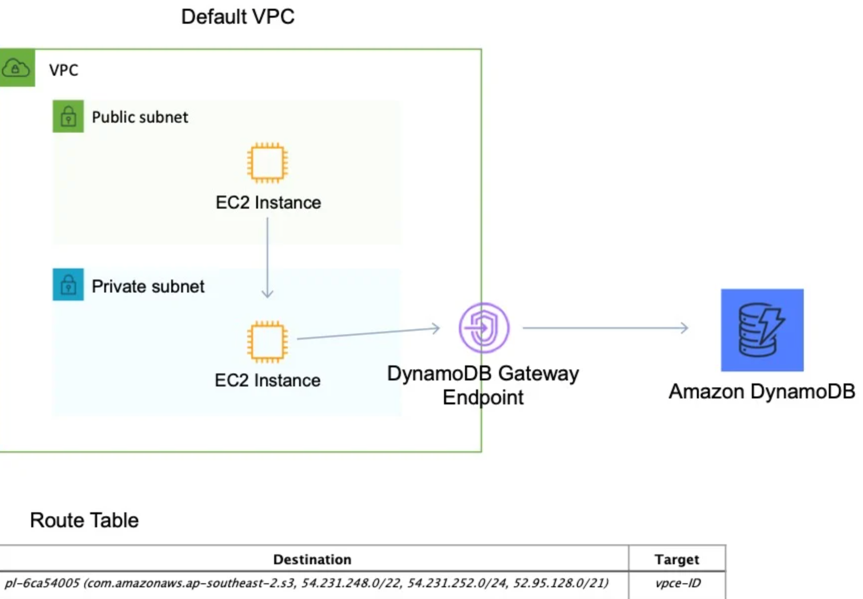

# AWS Gateway Endpoint

AWS Gateway Endpoint 是 Amazon VPC（Virtual Private Cloud，虚拟专用云）中的一项功能，它能够让 VPC 内的资源无需借助互联网网关、NAT
设备、VPN 连接或 AWS Direct Connect 连接，就可以与特定的 AWS 服务进行私有通信。下面将从多个方面对其进行详细解释：

### 工作原理

- **路由集成**：当在 VPC 中创建 Gateway Endpoint 时，实际上是在 VPC 的路由表中添加了特定的路由规则。这些规则将指向目标 AWS
  服务的流量导向 Gateway Endpoint。
- **私有网络连接**：Gateway Endpoint 会在 VPC 和目标 AWS 服务之间建立起一个私有连接。通过这个连接，VPC 内的资源（如 EC2
  实例）可以直接与 AWS 服务通信，流量不会流出 AWS 网络，从而保证了通信的安全性和低延迟性。

### 支持的服务

目前，AWS Gateway Endpoint 主要支持以下两种 AWS 服务：

- **Amazon S3**：借助 Gateway Endpoint，VPC 内的资源可以直接访问 Amazon S3 存储桶，而无需通过公共互联网。这对于需要频繁访问
  S3 存储桶的应用程序来说，能够显著提高数据传输的安全性和性能。
- **Amazon DynamoDB**：VPC 内的资源可以通过 Gateway Endpoint 直接与 Amazon DynamoDB 进行通信，避免了流量通过公共网络传输带来的潜在安全风险和延迟问题。

### 优势

1. **安全性提升**
    - 由于流量不会流出 AWS 网络，减少了数据暴露在公共互联网上的风险，降低了遭受网络攻击的可能性。
    - 可以结合 VPC 的安全组和网络访问控制列表（NACL）对流量进行更精细的访问控制，进一步增强安全性。
2. **性能优化**
    - 消除了通过公共互联网访问 AWS 服务时可能遇到的网络拥塞和高延迟问题，提供了更稳定、高效的通信连接。
    - 对于对网络延迟敏感的应用程序，如实时数据分析、高频交易系统等，能够显著提升性能。
3. **成本节约**
    - 避免了使用 NAT 网关或互联网网关产生的额外费用，降低了数据传输成本。
    - 减少了公共互联网带宽的使用，进一步节省了成本。

### 创建和使用步骤

1. **创建 Gateway Endpoint**
    - 登录 AWS 管理控制台，导航到 VPC 服务页面。
    - 在左侧导航栏中选择“Endpoint”，然后点击“创建端点”。
    - 在“服务名称”下拉列表中选择要连接的 AWS 服务（如 Amazon S3 或 Amazon DynamoDB）。
    - 选择要关联的 VPC 和路由表，然后点击“创建端点”完成创建。
2. **配置路由表**
    - 创建 Gateway Endpoint 后，需要在关联的路由表中添加路由规则，将目标 AWS 服务的流量导向该端点。例如，对于 Amazon S3
      服务，需要添加一条目标为 `s3` 的路由，将其指向新创建的 Gateway Endpoint。
3. **使用 Gateway Endpoint**
    - VPC 内的资源（如 EC2 实例）可以像访问公共服务一样访问目标 AWS 服务，无需进行额外的配置。流量会自动通过 Gateway
      Endpoint 进行传输。

### 注意事项

- **区域限制**：Gateway Endpoint 只能在特定的 AWS 区域内创建和使用，不同区域的 Gateway Endpoint 是相互独立的。
- **服务依赖**：确保 VPC 内的资源和目标 AWS 服务位于同一个区域，否则可能无法正常使用 Gateway Endpoint 进行通信。
- **权限管理**：需要为 VPC 内的资源配置适当的 IAM 权限，以允许它们访问目标 AWS 服务。 