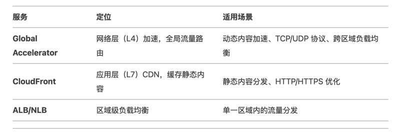

# AWS Global Accelerator

AWS Global Accelerator 是亚马逊云科技（AWS）提供的一项网络服务，旨在优化全球用户的应用程序访问速度和可用性。它通过利用 AWS
的全球网络基础设施（如边缘站点和骨干网），智能路由用户流量，减少延迟并提升性能。以下是其核心要点：

## 工作原理

- 静态入口 IP：提供两个固定的全局静态 IP（或自定义 IP），作为用户访问应用程序的入口点。即使后端资源变更（如更换区域或实例），IP
  地址保持不变。
- 智能流量路由：用户请求通过最近的 AWS 边缘节点接入，随后流量通过 AWS 内部高性能网络（非公共互联网）传输至后端。
- 健康检查与容灾：持续监控后端资源（如 EC2、ALB、NLB）的健康状态，自动将流量切换到健康节点，确保高可用性。

## 核心功能

- 全局负载均衡：支持跨多个 AWS 区域（Region）的负载均衡，优化全球用户的访问路径。
- 低延迟：利用 AWS 内网骨干传输，减少网络跳跃（hops），降低延迟。
- DDoS 防御集成：可与 AWS Shield 结合，提供针对网络层（Layer 3/4）攻击的防护。
- 客户端亲和性（Session Stickiness）：支持基于源 IP 的会话保持，确保用户请求定向到同一后端。

## 典型使用场景

- 全球分布式应用：用户遍布多地区，需低延迟访问（如游戏、实时通信）。
- 高可用性关键系统：要求故障时无缝切换（如金融交易、医疗系统）。
- 隐藏后端架构：通过固定 IP 暴露服务，后端变更不影响用户（如 API 网关）。
- 混合云架构：流量可路由至本地数据中心（需通过 AWS VPN 或 Direct Connect）。

## 优势对比其他服务

## 注意事项

- 协议支持：主要针对 TCP/UDP，HTTP/HTTPS 需结合 ALB 或 CloudFront。
- 成本优化：若仅需区域级负载均衡，可能优先使用 ALB/NLB。
- 与 Route 53 协同：可搭配 DNS 服务实现更灵活的流量策略（如地理位置路由）。

## 总结

AWS Global Accelerator 是提升全球应用性能和高可用的利器，尤其适合需要稳定入口
IP、跨区域容灾和低延迟的场景。通过减少网络波动和自动故障转移，它帮助用户构建更健壮的全球化架构。