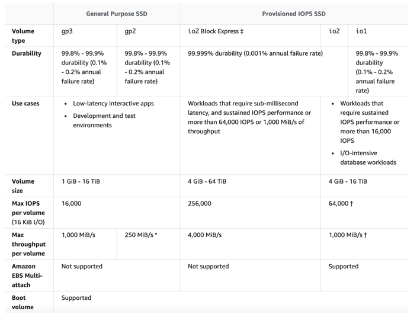

# Amazon EBS（Elastic Block Store）General Purpose SSD

Amazon EBS（Elastic Block Store）General Purpose SSD
是亚马逊云科技（AWS）提供的一种存储卷类型，属于固态硬盘（SSD）存储，适用于广泛的工作负载，能在性能和成本之间取得良好平衡。以下从多个方面详细解释：

### 基本概念

EBS 是 AWS 提供的一种持久块存储服务，可与 Amazon EC2 实例配合使用。General Purpose SSD（gp2 和 gp3）则是 EBS
众多存储卷类型中的一类，它以固态硬盘为基础，提供了较高的性能和可靠性。

### 主要特点

1. **高性能**
    - **低延迟**：由于采用 SSD 技术，General Purpose SSD
      能够提供极低的读写延迟，确保数据能够快速被访问。这对于对响应时间要求较高的应用程序（如数据库、在线交易系统等）至关重要，可以显著提升应用程序的性能和用户体验。
    - **高 IOPS（Input/Output Operations Per Second）**：它可以提供较高的每秒输入/输出操作数，能够满足高并发工作负载的需求。例如，在处理大量的小文件读写操作时，高
      IOPS 可以确保数据的快速读写，提高系统的整体吞吐量。
2. **成本效益**
    - General Purpose SSD
      在提供良好性能的同时，具有相对较低的成本。对于大多数中小规模的应用程序和工作负载来说，它是一种经济实惠的存储选择。用户无需为了追求高性能而支付过高的费用，能够在性能和成本之间找到合适的平衡点。
3. **自动扩展**
    - gp3 卷支持在不中断实例的情况下动态调整存储容量、IOPS
      和吞吐量。这意味着用户可以根据应用程序的实际需求，灵活地增加或减少存储资源，避免了过度配置或资源不足的问题。例如，在业务高峰期，可以临时增加卷的
      IOPS 和吞吐量，以应对更高的工作负载。
4. **可靠性和耐用性**
    - EBS General Purpose SSD 具有较高的可靠性和耐用性。AWS
      会自动对存储卷进行备份和数据冗余处理，确保数据的安全性和可用性。即使在硬件故障或其他异常情况下，数据也能得到有效的保护，减少数据丢失的风险。

### 类型及区别

1. **gp2**
    - 早期的通用 SSD 卷类型，其 IOPS 性能与存储容量成正比。默认情况下，每 1GB 存储容量可以提供 3 个 IOPS，最大可达到 16,000
      个 IOPS。例如，一个 100GB 的 gp2 卷，理论上可以提供 300 个 IOPS。
    - 适用于大多数通用型工作负载，如开发和测试环境、小型数据库等。
2. **gp3**
    - 新一代的通用 SSD 卷类型，在性能和灵活性上有了显著提升。它可以独立配置存储容量、IOPS 和吞吐量，不受存储容量的限制。用户可以根据实际需求，为
      gp3 卷设置最高达 16,000 个 IOPS 和 1,000MB/s 的吞吐量。
    - 相比 gp2，gp3 在相同的性能配置下成本更低，适合对性能和成本都有较高要求的工作负载。

### 应用场景

1. **通用型应用程序**：适用于各种通用型的 Web 应用程序、内容管理系统等。这些应用程序通常需要快速的读写性能来处理用户请求，General
   Purpose SSD 可以满足它们的性能需求。
2. **开发和测试环境**：在开发和测试阶段，需要快速部署和调整存储资源。General Purpose SSD
   的成本效益和灵活性使其成为理想的选择，能够帮助开发人员快速搭建和测试应用程序。
3. **小型数据库**：对于一些小型的关系型数据库（如 MySQL、PostgreSQL）或 NoSQL 数据库（如 MongoDB），General Purpose SSD
   可以提供足够的性能来支持数据的读写操作。

### 使用方法

1. **创建 EBS 卷**：可以通过 AWS 管理控制台、AWS CLI 或 AWS SDK 来创建 General Purpose SSD 卷。在创建过程中，需要指定卷的类型（gp2
   或 gp3）、存储容量等参数。
2. **附着到 EC2 实例**：创建好 EBS 卷后，需要将其附着到运行中的 EC2 实例上。这样，实例就可以像使用本地硬盘一样使用 EBS
   卷进行数据存储和读写操作。
3. **格式化和挂载**：在 EC2 实例上，需要对附着的 EBS 卷进行格式化（如使用 ext4、XFS 等文件系统），并将其挂载到指定的目录下，以便应用程序可以访问该卷上的数据。 