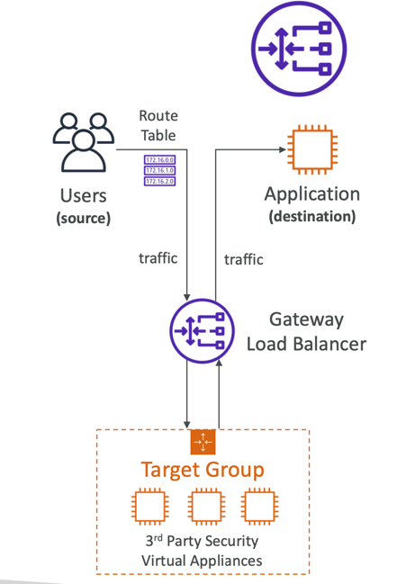
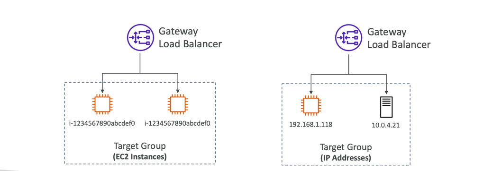
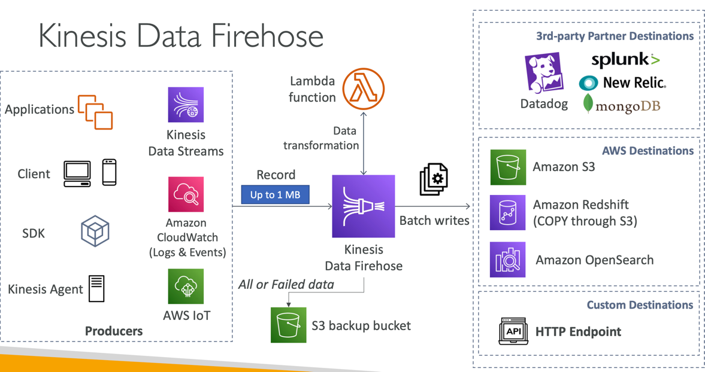

# CloudFront – Price Classes

- You can reduce the number of edge locations for cost reduction
- Three price classes:
    1. Price Class All: all regions – best performance
    2. Price Class 200: most regions, but excludes the most expensive regions
    3. Price Class 100: only the least expensive regions

# DFSR

Distributed File System Replication

# Gateway Load Balancer

- Deploy, scale, and manage a fleet of 3rd party Route Table network virtual appliances in AWS
- Example: Firewalls, Intrusion Detection and Prevention Systems, Deep Packet Inspection Systems, payload
  manipulation, …
- Operates at Layer 3 (Network Layer) – IP Packets
- Combines the following functions:
    - Transparent Network Gateway – single entry/exit for all traffic
    - Load Balancer – distributes traffic to your virtual appliances
- Uses the GENEVE protocol on port 6081
  

# Gateway Load Balancer – Target Groups

- EC2 instances
- IP Addresses – must be private IPs

# Kinesis Data Firehose

- Fully Managed Service, no administration, automatic scaling, serverless
  • AWS: Redshift / Amazon S3 / OpenSearch
  • 3rd party partner: Splunk / MongoDB / DataDog / NewRelic / …
  • Custom: send to any HTTP endpoint
- Pay for data going through Firehose
- Near Real Time
  • Buffer interval: 0 seconds (no buffering) to 900 seconds
  • Buffer size: minimum 1MB
- Supports many data formats, conversions, transformations, compression
- Supports custom data transformations using AWS Lambda
- Can send failed or all data to a backup S3 bucket

# AWS WAF – Web Application Firewall

- Protects your web applications from common web exploits (Layer 7)
- Layer 7 is HTTP (vs Layer 4 is TCP/UDP)
- Deploy on
  • Application Load Balancer
  • API Gateway
  • CloudFront
  • AppSync GraphQL A
  • Cognito User Pool
- Define Web ACL (Web Access Control List) Rules:
  • IP Set: up to 10,000 IP addresses – use multiple Rules for more IPs
  • HTTP headers, HTTP body, or URI strings Protects from common attack - SQL injection and Cross-Site Scripting (XSS)
  • Size constraints, geo-match (block countries)
  • Rate-based rules (to count occurrences of events) – for DDoS protection
- Web ACL are Regional except for CloudFront
- A rule group is a reusable set of rules that you can add to a web ACL

# S3 Object Lock (versioning must be enabled)

- Adopt a WORM (Write Once Read Many) model
- Block an object version deletion for a specified amount of time
- Retention mode - Compliance:
  • Object versions can't be overwritten or deleted by any user, including the root user
  • Objects retention modes can't be changed, and retention periods can't be shortened
- Retention mode - Governance:
  • Most users can't overwrite or delete an object version or alter its lock settings
  • Some users have special permissions to change the retention or delete the object
- Retention Period: protect the object for a fixed period, it can be extended
- Legal Hold:
  • protect the object indefinitely, independent from retention period
  • can be freely placed and removed using the s3:PutObjectLegalHold IAM permission