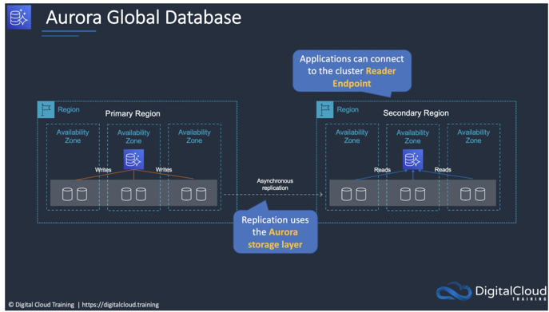

# Amazon Aurora Global Database

Amazon Aurora Global Database 是亚马逊云科技（AWS）为 Amazon Aurora 数据库引擎推出的一项强大功能，主要用于实现跨区域的数据库复制和全球数据分发。以下从多个方面对其进行详细解释：

### 核心概念

  
Amazon Aurora 本身是一种与 MySQL 和 PostgreSQL 兼容的高性能关系型数据库，而 Amazon Aurora Global Database 则在此基础上提供了一种在多个
AWS 区域之间快速、可靠地复制数据的解决方案，让用户能够在全球范围内实现低延迟的数据访问。

### 主要特点

1. **快速跨区域复制**
    - Amazon Aurora Global Database 采用了专门设计的复制技术，能够以非常高的速度将数据从主区域复制到最多 5
      个辅助区域。这种快速复制机制确保了在不同区域的数据副本之间保持高度的一致性，并且延迟极低。例如，在主区域进行的写操作可以在数秒内同步到辅助区域，使得全球各地的用户都能及时访问到最新的数据。
2. **低延迟读取**
   -
   在每个辅助区域，用户可以创建只读副本，这些副本可以为本地应用程序提供低延迟的读取服务。对于全球性的应用程序来说，这意味着不同地区的用户可以直接从本地的数据库副本读取数据，避免了因跨区域数据传输而导致的高延迟问题，大大提高了应用程序的响应速度和用户体验。
3. **高可用性和灾难恢复**
    - 由于数据在多个区域都有副本，Amazon Aurora Global Database
      具备很高的可用性和灾难恢复能力。如果主区域发生故障或灾难，用户可以快速将一个辅助区域提升为主区域，继续提供数据库服务，从而实现快速的故障转移和业务连续性。
4. **可扩展性**
    - 可以根据应用程序的需求，在主区域和辅助区域灵活扩展数据库的容量和性能。在主区域，可以通过添加写入实例来处理更多的写流量；在辅助区域，可以增加只读副本的数量来满足不断增长的读需求。
5. **与 Amazon Aurora 无缝集成**
    - Amazon Aurora Global Database 与 Amazon Aurora 的其他功能无缝集成，如自动扩展、备份和恢复、安全等。用户可以继续使用
      Amazon Aurora 提供的各种工具和特性来管理和维护数据库，无需进行额外的复杂配置。

### 工作原理

1. **主区域和辅助区域**
    - 主区域是数据库的写入中心，所有的写操作都首先在主区域进行处理。主区域会将数据变更记录下来，并通过专用的复制通道将这些变更快速传播到各个辅助区域。
    - 辅助区域接收主区域传来的数据变更，并将其应用到本地的数据库副本上。辅助区域主要用于提供只读服务，为本地应用程序提供低延迟的数据访问。
2. **数据复制机制**
    - Amazon Aurora Global Database 使用了一种基于日志的复制机制，主区域会将数据库的事务日志（如 MySQL 的二进制日志或
      PostgreSQL 的预写日志）实时复制到辅助区域。辅助区域根据这些日志信息，在本地数据库副本上重放事务，从而保持数据的一致性。

### 应用场景

1. **全球性应用程序**
    - 对于面向全球用户的应用程序，如社交媒体平台、在线游戏等，Amazon Aurora Global Database
      可以确保不同地区的用户都能以低延迟访问数据，提高应用程序的性能和用户满意度。
2. **灾难恢复和业务连续性**
    - 企业可以利用 Amazon Aurora Global Database 的多区域复制功能，建立强大的灾难恢复解决方案。在主区域发生故障时，能够快速切换到辅助区域，确保业务的持续运行，减少数据丢失和业务中断的风险。
3. **数据分析和报表**
    - 在不同地区的团队可能需要对数据库中的数据进行分析和生成报表。通过在本地辅助区域创建只读副本，可以让各地区的团队直接从本地副本读取数据，避免了跨区域数据传输的延迟和成本。

### 使用方法

1. **创建 Global Database**
    - 通过 AWS 管理控制台、AWS CLI 或 AWS SDK 可以创建 Amazon Aurora Global
      Database。在创建过程中，需要指定主区域和要包含的辅助区域，以及数据库引擎（MySQL 或 PostgreSQL）和其他相关配置。
2. **管理和监控**
    - 可以使用 Amazon RDS 控制台和 CloudWatch 等工具对 Amazon Aurora Global Database
      进行管理和监控。监控指标包括复制延迟、读取和写入性能等，以便及时发现和解决问题。
3. **故障转移和提升**
    - 在需要进行故障转移时，可以通过 AWS 管理控制台或 API 快速将一个辅助区域提升为主区域。提升操作会自动完成必要的配置更改，确保新的主区域能够正常提供写入服务。 