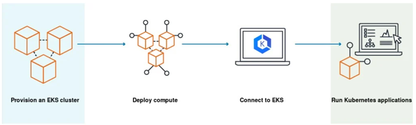

# Amazon EKS

Amazon EKS（Amazon Elastic Kubernetes Service）是亚马逊云科技（AWS）提供的一项托管式 Kubernetes 服务，用于在 AWS
上轻松部署、管理和扩展容器化应用程序。以下从多个方面详细介绍 Amazon EKS：

### 核心概念

  
Kubernetes 是一个开源的容器编排平台，用于自动化部署、扩展和管理容器化应用程序。Amazon EKS 则是 AWS 对 Kubernetes
的托管实现，它负责处理 Kubernetes 控制平面的运维工作，让用户可以专注于运行应用程序。

### 主要特点

1. **托管式服务**
    - EKS 管理 Kubernetes 控制平面的所有关键组件，包括 API 服务器、调度器和控制器管理器等。AWS
      负责控制平面的升级、监控、维护和故障修复，减轻了用户的管理负担。
    - 用户无需担心控制平面的高可用性、安全性和性能问题，AWS 会自动确保控制平面的稳定运行。
2. **高可用性**
    - EKS 控制平面在多个可用区（Availability Zone）中部署，具备高可用性和容错能力。即使某个可用区出现故障，控制平面仍然可以正常工作，确保应用程序的连续性。
    - 用户可以将工作节点（Worker Node）部署在多个可用区，进一步提高应用程序的可用性和容错性。
3. **安全可靠**
    - EKS 集成了 AWS 的安全功能，如 IAM（Identity and Access Management）用于用户身份验证和授权，VPC（Virtual Private
      Cloud）用于网络隔离，以及加密服务用于数据保护。
    - AWS 定期对 EKS 进行安全审计和漏洞修复，确保服务的安全性和可靠性。
4. **兼容性和扩展性**
    - EKS 与标准的 Kubernetes API 兼容，用户可以使用现有的 Kubernetes 工具和插件，如 kubectl 命令行工具、Helm 包管理器等。
    - 支持与其他 AWS 服务集成，如 Amazon S3、Amazon RDS、AWS Lambda 等，方便构建复杂的应用程序架构。用户可以根据业务需求轻松扩展集群规模，添加或删除工作节点。

### 工作原理

1. **控制平面**：AWS 负责运行和管理 EKS 控制平面，包括 API 服务器、调度器、控制器管理器等组件。控制平面负责接收和处理用户的
   Kubernetes 命令，调度工作负载到合适的工作节点上。
2. **工作节点**：用户需要在自己的 AWS 账户中创建和管理工作节点，这些节点可以是 EC2 实例或 Fargate
   计算资源。工作节点运行容器化应用程序，并与控制平面进行通信，接收和执行调度任务。
3. **网络通信**：EKS 使用 VPC 进行网络隔离和通信，用户可以配置安全组和网络访问控制列表（NACL）来控制进出集群的网络流量。Kubernetes
   网络插件（如 Amazon VPC CNI）负责实现容器之间的网络通信。

### 应用场景

1. **微服务架构**：对于采用微服务架构的应用程序，EKS 可以帮助用户轻松管理和编排大量的容器化微服务，实现服务的自动化部署、扩展和故障恢复。
2. **大数据和分析**：结合 AWS 的大数据服务（如 Amazon EMR、Amazon Redshift），EKS 可以用于运行大数据处理和分析任务，如数据清洗、机器学习训练等。
3. **Web 应用程序**：可以将 Web 应用程序容器化后部署到 EKS 集群中，利用 EKS 的自动扩展和负载均衡功能，确保应用程序能够应对不同的流量负载。

### 使用步骤

1. **创建 EKS 集群**：可以通过 AWS 管理控制台、AWS CLI 或 AWS CloudFormation 等方式创建 EKS 集群。在创建过程中，需要指定集群的名称、版本、VPC
   等信息。
2. **配置工作节点**：创建并配置工作节点组，选择合适的 EC2 实例类型或使用 Fargate 计算资源。将工作节点组与 EKS
   集群关联，使工作节点能够加入集群并接收调度任务。
3. **部署应用程序**：使用 Kubernetes 工具（如 kubectl）编写和部署应用程序的配置文件（如 Deployment、Service 等），将容器化应用程序部署到
   EKS 集群中。
4. **监控和管理**：使用 AWS CloudWatch 等监控工具监控 EKS 集群的性能和资源使用情况，及时进行故障排查和优化。 