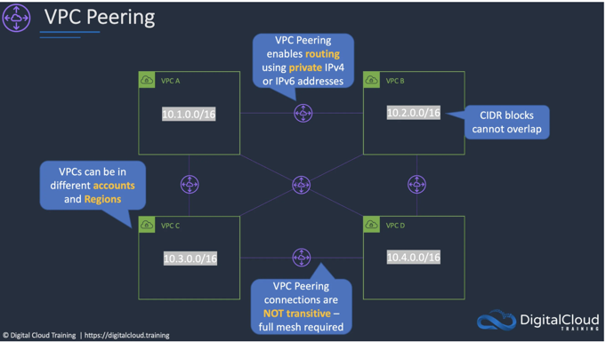

# VPC Peering

## 定义

VPC Peering（虚拟专用云对等连接）是 Amazon Web
Services（AWS）提供的一项网络功能，用于在两个不同的虚拟专用云（VPC）之间建立直接的网络连接，使它们能够像处于同一个网络中一样进行通信。这里的
VPC 是用户在 AWS 上创建的逻辑隔离的网络空间，用户可以在其中启动 AWS 资源，如 EC2 实例等。VPC Peering 不仅适用于 AWS
环境，在其他云服务提供商中也有类似概念和功能。

## 工作原理

### 连接建立

1. **发起请求**：用户需要在 AWS 管理控制台、AWS CLI 或使用 AWS SDK 发起 VPC Peering 连接请求。请求方指定自己的 VPC（本地
   VPC）和想要连接的目标 VPC（对等 VPC）。
2. **接受请求**：目标 VPC 的所有者需要接受这个请求。一旦请求被接受，VPC Peering 连接就建立起来了。

### 路由配置

连接建立后，需要在两个 VPC 的路由表中分别添加指向对方 VPC 的路由规则。这些规则告诉 VPC 如何将流量导向对等 VPC。例如，如果本地
VPC 的 CIDR 块是 `10.0.0.0/16`，对等 VPC 的 CIDR 块是 `10.1.0.0/16`，那么在本地 VPC 的路由表中需要添加一条目标为
`10.1.0.0/16` 的路由，下一跳指向 VPC Peering 连接；在对等 VPC 的路由表中添加一条目标为 `10.0.0.0/16` 的路由，下一跳同样指向该
VPC Peering 连接。

### 流量传输

完成路由配置后，两个 VPC 内的资源（如 EC2 实例）就可以通过 VPC Peering 连接相互通信。流量在两个 VPC
之间直接传输，不经过公共互联网，从而提高了通信的安全性和性能。

## 特点

### 网络隔离

虽然 VPC Peering 允许两个 VPC 进行通信，但它们仍然保持逻辑上的隔离。每个 VPC 仍然有自己独立的安全组、网络访问控制列表（NACL）等安全机制，用户可以根据需要对跨
VPC 的流量进行精细的访问控制。

### 非传递性

VPC Peering 连接是一对一的，不具有传递性。也就是说，如果 VPC A 与 VPC B 建立了对等连接，VPC B 与 VPC C 建立了对等连接，并不意味着
VPC A 与 VPC C 之间可以直接通信。如果需要 VPC A 与 VPC C 通信，必须单独建立 VPC Peering 连接。

### 跨区域支持

AWS 的 VPC Peering 支持跨区域连接，用户可以在不同的 AWS 区域之间建立 VPC Peering 连接，实现跨区域的资源通信和数据共享。不过，跨区域的
VPC Peering 可能会产生一定的网络延迟和费用。

## 优势

### 增强资源共享

不同 VPC 中的资源可以方便地共享数据和服务，例如一个 VPC 中的数据库服务器可以为另一个 VPC 中的应用服务器提供数据支持，提高了资源的利用率和灵活性。

### 提高安全性

与通过公共互联网进行通信相比，VPC Peering 连接提供了更安全的通信方式。由于流量不经过公共网络，减少了数据泄露和遭受网络攻击的风险。

### 简化网络架构

通过 VPC Peering，可以避免使用复杂的 VPN 或其他网络连接方式，简化了网络架构的设计和管理，降低了运维成本。

## 应用场景

### 企业多部门网络通信

企业不同部门可能使用不同的 VPC 来隔离各自的资源，但有时需要部门之间的资源进行通信。例如，研发部门的 VPC 中的开发服务器需要访问生产部门
VPC 中的测试数据库，通过 VPC Peering 可以方便地实现这种通信。

### 混合云环境集成

在混合云环境中，企业可能有一部分资源部署在本地数据中心（通过 AWS Direct Connect 或 VPN 连接到 AWS），另一部分资源部署在 AWS
的 VPC 中。通过 VPC Peering，可以将不同 VPC 中的资源连接起来，实现混合云环境下的资源协同工作。

### 跨区域数据同步

对于在多个 AWS 区域有业务部署的企业，VPC Peering 可以用于跨区域的数据同步和备份。例如，将一个区域 VPC 中的数据定期同步到另一个区域的
VPC 中，以提高数据的可用性和灾难恢复能力。 