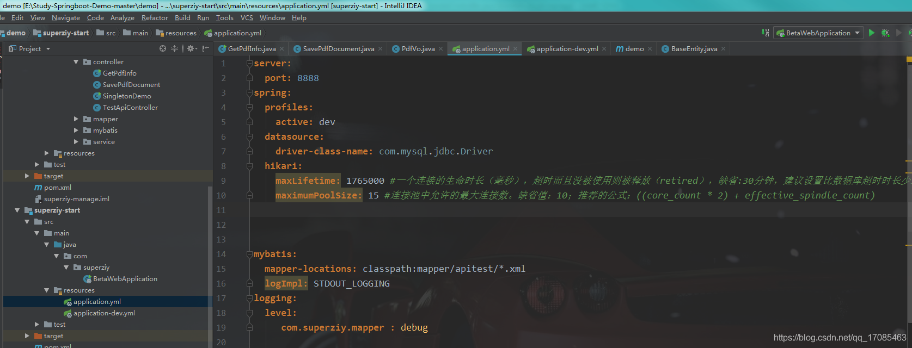
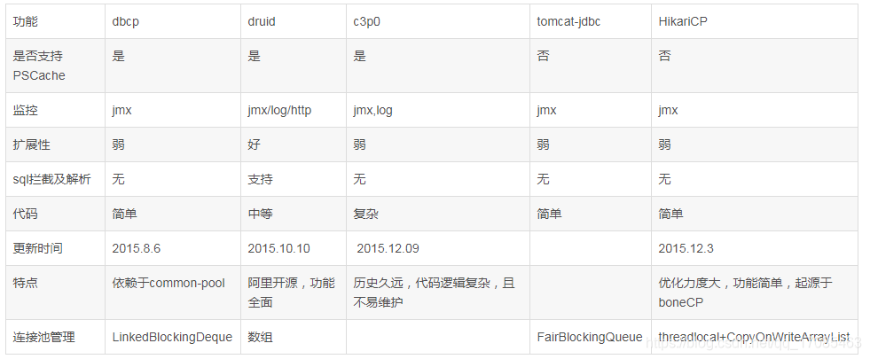

# HiKariCP和Druid对比

## 背景

我们所熟知的C3P0，DBCP,Druid, HiKariCP为我们所常用的数据库连接池，

其中C3P0已经很久没有更新了。DBCP更新速度很慢，基本处于不活跃状态，而Druid和HikariCP处于活跃状态的更新中，这就是我们说的二代产品了。

## 详细介绍

### HiKariCP

1. 字节码精简 ：优化代码，直到编译后的字节码最少，这样，CPU缓存可以加载更多的程序代码；
2. 优化代理和拦截器 ：减少代码，例如HikariCP的Statement proxy只有100行代码，只有BoneCP的十分之一；
3. 自定义数组类型（FastStatementList）代替ArrayList ：避免每次get()调用都要进行range check，避免调用remove()时的从头到尾的扫描；
4. 自定义集合类型（ConcurrentBag ：提高并发读写的效率；
5. 其他针对BoneCP缺陷的优化。

HiKari在springboot2.0上默认使用无需配置

### Druid

1. Druid提供性能卓越的连接池功能外，还集成了SQL监控，黑名单拦截等功能，
2. 强大的监控特性，通过Druid提供的监控功能，可以清楚知道连接池和SQL的工作情况。
    1. 监控SQL的执行时间、ResultSet持有时间、返回行数、更新行数、错误次数、错误堆栈信息；
    2. SQL执行的耗时区间分布。什么是耗时区间分布呢？比如说，某个SQL执行了1000次，其中0~1毫秒区间50次，1~10毫秒800次，10~
       100毫秒100次，100~1000毫秒30次，1~10秒15次，10秒以上5
       次。通过耗时区间分布，能够非常清楚知道SQL的执行耗时情况；
    3. 监控连接池的物理连接创建和销毁次数、逻辑连接的申请和关闭次数、非空等待次数、PSCache命中率等。
3. 方便扩展。
   Druid提供了Filter-Chain模式的扩展API，可以自己编写Filter拦截JDBC中的任何方法，可以在上面做任何事情，比如说性能监控、SQL审计、用户名密码加密、日志等等。
4. Druid集合了开源和商业数据库连接池的优秀特性，并结合阿里巴巴大规模苛刻生产环境的使用经验进行优化。
    1. 替换DBCP和C3P0。Druid提供了一个高效、功能强大、可扩展性好的数据库连接池。
    2. 可以监控数据库访问性能，Druid内置提供了一个功能强大的StatFilter插件，能够详细统计SQL的执行性能，这对于线上分析数据库访问性能有帮助。
    3. 数据库密码加密。直接把数据库密码写在配置文件中，这是不好的行为，容易导致安全问题。DruidDruiver和DruidDataSource都支持PasswordCallback。
    4. SQL执行日志，Druid提供了不同的LogFilter，能够支持Common-Logging、Log4j和JdkLog，你可以按需要选择相应的LogFilter，监控你应用的数据库访问情况。
    5. 扩展JDBC，如果你要对JDBC层有编程的需求，可以通过Druid提供的Filter机制，很方便编写JDBC层的扩展插件。

## 总结

针对现在更多的连接池，我们也应该结合项目情况，选择相应合适的连接池

