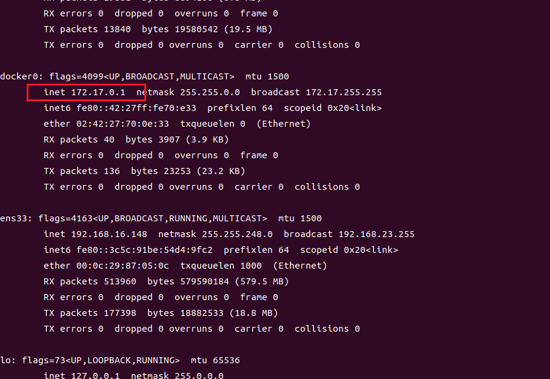

# docker容器访问本地数据库或从Docker容器内部连接到计算机，127.0.0.1，localhost均无法访问

## 问题背景

docker容器内服务怎么连接物理机服务
场景为当应用某个应用使用本地Docker容器部署，但是还需要访问本地服务时（如数据库），使用宿主机IP，127.0.0.1，localhost均无法访问，后2者好理解，
都属于Docker容器的回环地址，前者：相当于Docker本身，对于Docker来说，容器与宿主机是用Docker虚拟机的网关来通讯，所以无法联接。

## 如何解决

1. 使用宿主机的公网ip地址，如下图  
   

2. 使用docker容器与宿主机之间通信的ip  
   

3. 使用Docker主机网络模式  
   在 Docker Compose 文件或 Docker 命令中使用 network_mode: host，这将使容器与物理主机共享网络命名空间。
   这样，容器内的服务可以直接使用物理机的 IP 地址和数据库服务进行通信，就像它们在同一主机上运行一样。

4. 创建Docker网络并连接容器和物理机  
   创建一个自定义的 Docker 网络，并将容器和物理机连接到该网络。这样，容器和物理机可以使用容器在该网络中分配的 IP
   地址进行通信。你可以在 Docker Compose 文件中定义一个自定义网络，并将容器和物理机连接到该网络。
   ~~~yaml
   version: '3'
   services:
     myapp:
       image: myapp-image
       networks:
         - mynetwork
   networks:
     mynetwork:
       driver: bridge
   ~~~
   在上述示例中，我们创建了一个名为 mynetwork 的自定义网络，并将 myapp 容器连接到该网络。 容器内的服务可以使用 mynetwork
   网络中的
   IP 地址来连接到物理机上的数据库。

