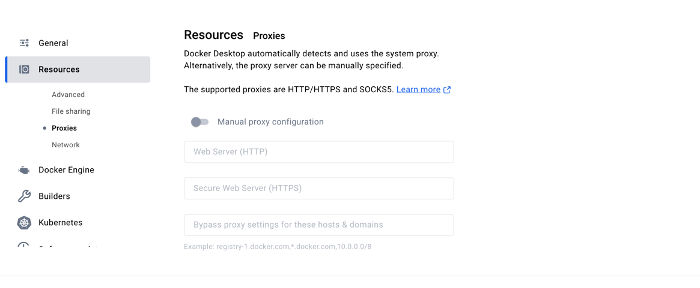

## 现象

Error response from daemon: Get "https://registry-1.docker.io/v2/": read tcp 192.168.5.15:57096->98.85.153.80:443: read:
connection reset by peer

## 原因

电脑开启有代理没生效或者公司网络不允许访问docker

## 解决方式

关闭docker desktop的手动代理，使用电脑本身的全局代理
