# @Bean 与 @Component 用在同一个类上，会怎么样？

## 疑虑背景

引用 https://mp.weixin.qq.com/s/IyTXK1IdpujZQNA81DK2Qg

### 疑虑描述

最近，在进行开发的过程中，发现之前的一个写法，类似如下

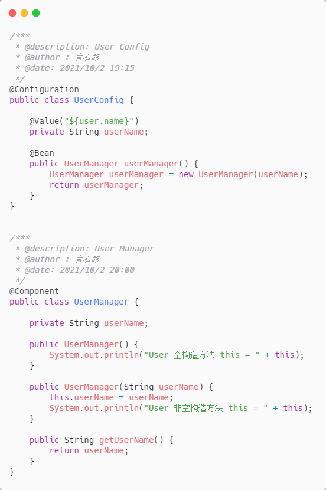  
以我的理解，@Configuration 加 @Bean 会创建一个 userName 不为 null 的 UserManager 对象，而 @Component
也会创建一个userName为null的UserManager对象那么我们在其他对象中注入 UserManager
对象时，到底注入的是哪个对象？因为项目已经上线了很长一段时间了，所以这种写法没有编译报错，运行也没有出问题后面去找同事了解下，实际是想让

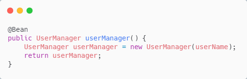

生效，而实际也确实是它生效了那么问题来了：Spring 容器中到底有几个 UserManager 类型的对象？

### Spring Boot 版本

项目中用的 Spring Boot 版本是：2.0.3.RELEASE  
对象的 scope 是默认值，也就是 singleton

## 结果验证

验证方式有很多,可以debug跟源码看看Spring容器中到底有几个UserManager对象,也可以直接从UserManager构造方法下手，看看哪几个构造方法被调用等等  
我们从构造方法下手，看看 UserManager 到底实例化了几次

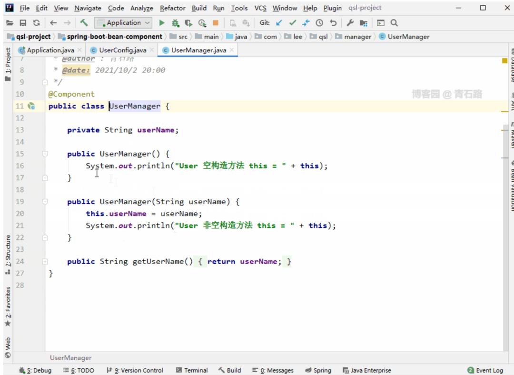

只有有参构造方法被调用了，无参构造方法岿然不动（根本没被调用  
既然 UserManager 构造方法只被调用了一次，那么前面的问题：到底注入的是哪个对象  
答案也就清晰了,没得选了呀，只能是@Configuration加@Bean创建的userName不为null的UserManager对象  
问题又来了：为什么不是 @Component 创建的 userName 为 null 的 UserManager 对象？

## 源码解析

@Configuration 与 @Component 关系很紧密

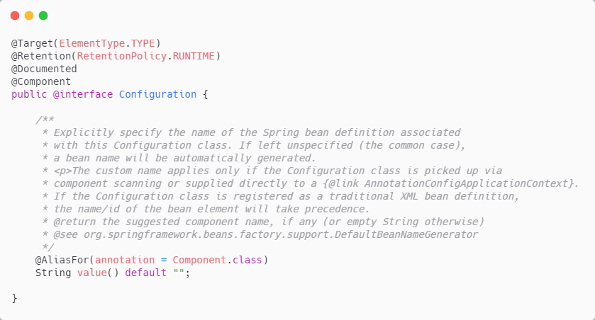

所以@Configuration 能够被 component scan

其中 ConfigurationClassPostProcessor 与@Configuration 息息相关，其类继承结构图如下：

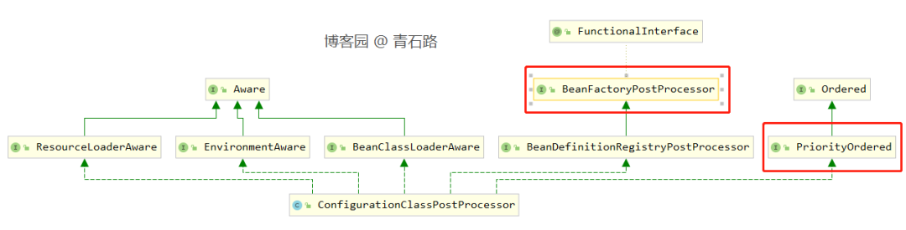

它实现了 BeanFactoryPostProcessor 接口和 PriorityOrdered 接口，关于 BeanFactoryPostProcessor，

那么我们从 AbstractApplicationContext 的 refresh 方法调用的 invokeBeanFactoryPostProcessors(beanFactory)开始，来跟下源码

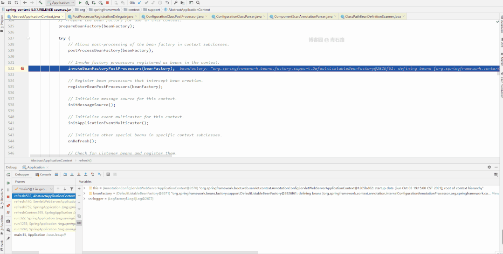

此时完成了 com.lee.qsl 包下的 component scan ， com.lee.qsl 包及子包下的 UserConfig 、 UserController 和 UserManager
都被扫描出来

注意，此刻@Bean 的处理还未开始， UserManager 是通过@Component 而被扫描出来的；此时 Spring 容器中 beanDefinitionMap 中的
UserManager 是这样的

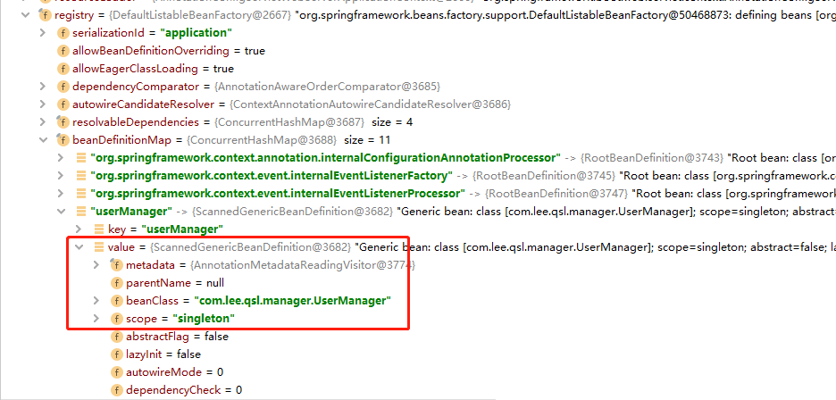

接下来一步很重要，与我们想要的答案息息相关

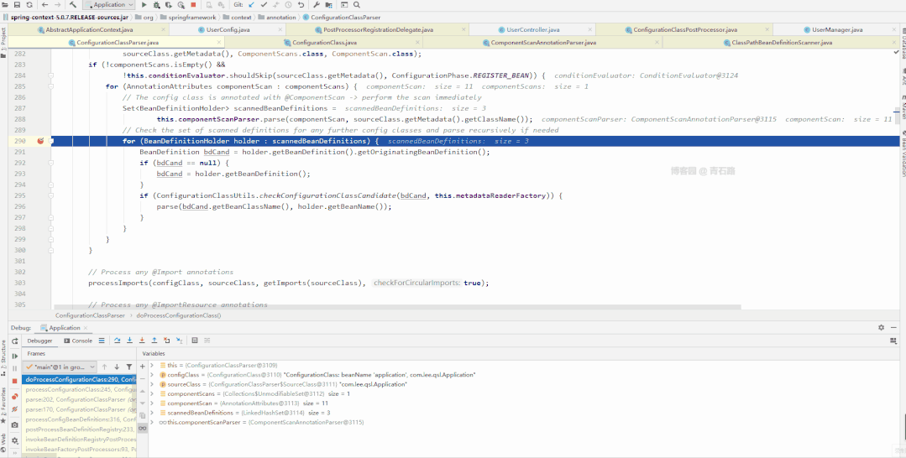

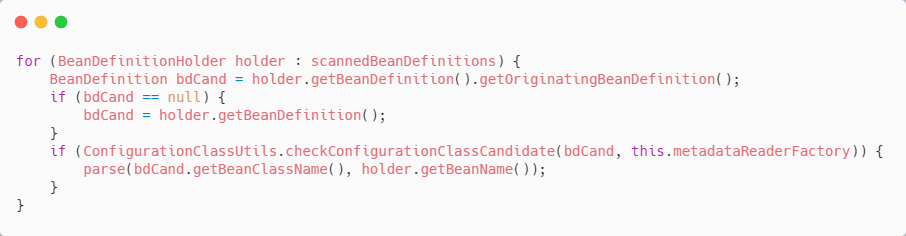

循环递归处理 UserConfig 、 UserController 和 UserManager ，把它们都封装成 ConfigurationClass ，递归扫描 BeanDefinition

循环完之后，我们来看看 configClasses

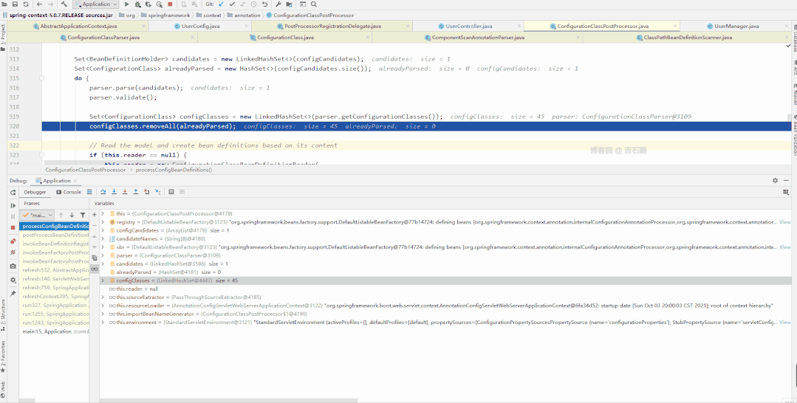

UserConfig bean 定义信息中 beanMethods
中有一个元素 [BeanMethod:name=userManager,declaringClass=com.lee.qsl.config.UserConfig]

然后我们接着往下走，来仔细看看答案出现的环节

是不是有什么发现？@Component 修饰的 UserManager 定义直接被覆盖成了 @Configuration + @Bean 修饰的 UserManager 定义

Bean 定义类型也由 ScannedGenericBeanDefinition 替换成了 ConfigurationClassBeanDefinition

后续通过 BeanDefinition 创建实例的时候，创建的自然就是 @Configuration + @Bean 修饰的 UserManager ，也就是会反射调用
UserManager 的有参构造方法

自此，答案也就清楚了

Spring 其实给出了提示

```text
2021-10-03 20:37:33.697  INFO 13600 --- [           
main] o.s.b.f.s.DefaultListableBeanFactory     : Overriding bean definition for bean 'userManager' with a different definition: replacing [Generic bean: class [com.lee.qsl.manager.UserManager]; scope=singleton; abstract=false; lazyInit=false; autowireMode=0; dependencyCheck=0; autowireCandidate=true; primary=false; factoryBeanName=null; factoryMethodName=null; initMethodName=null; destroyMethodName=null; defined in file [D:\qsl-project\spring-boot-bean-component\target\classes\com\lee\qsl\manager\UserManager.class]] with [Root bean: class [null]; scope=; abstract=false; lazyInit=false; autowireMode=3; dependencyCheck=0; autowireCandidate=true; primary=false; factoryBeanName=userConfig; factoryMethodName=userManager; initMethodName=null; destroyMethodName=(inferred); defined in class path resource [com/lee/qsl/config/UserConfig.class]]
```

## Spring 升级优化

可能 Spring 团队意识到了 info 级别太不显眼的问题，或者说意识到了直接覆盖的处理方式不太合理

所以在 Spring 5.1.2.RELEASE （Spring Boot 则是 2.1.0.RELEASE ）做出了优化处理

我们来具体看看

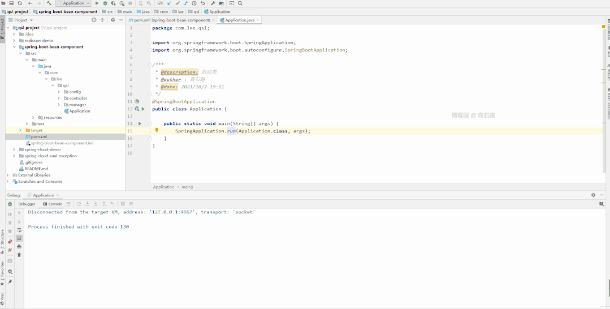

启动直接报错，Spring 也给出了提示

```text
The bean 'userManager', defined in class path resource [com/lee/qsl/config/UserConfig.class], could not be registered. A bean with that name has already been defined in file [D:\qsl-project\spring-boot-bean-component\target\classes\com\lee\qsl\manager\UserManager.class] and overriding is disabled.
```

我们来跟下源码，主要看看与 Spring 5.0.7.RELEASE 的区别

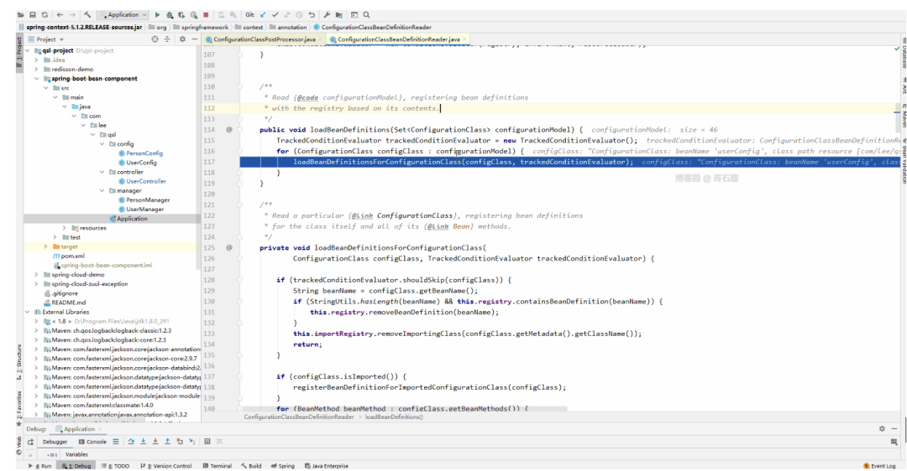

新增了配置项 allowBeanDefinitionOverriding 来控制是否允许 BeanDefinition 覆盖，默认情况下是不允许的

我们可以在配置文件中配置：spring.main.allow-bean-definition-overriding=true ，允许 BeanDefinition 覆盖

这种处理方式是更优的，将选择权交给开发人员，而不是自己偷偷的处理，已达到开发者想要的效果

## 总结

Spring 5.0.7.RELEASE （ Spring Boot 2.0.3.RELEASE ） 支持@Configuration + @Bean 与@Component 同时作用于同一个类

启动时会给 info 级别的日志提示，同时会将@Configuration + @Bean 修饰的 BeanDefinition 覆盖掉@Component 修饰的
BeanDefinition

也许 Spring 团队意识到了上述处理不太合适，于是在 Spring 5.1.2.RELEASE 做出了优化处理

增加了配置项：allowBeanDefinitionOverriding ，将主动权交给了开发者，由开发者自己决定是否允许覆盖

补充
关于 allowBeanDefinitionOverriding ，前面讲的不对，后面特意去翻了下源码，补充如下

Spring 1.2 引进 DefaultListableBeanFactory 的时候就有了 private boolean allowBeanDefinitionOverriding = true;，默认是允许
BeanDefinition 覆盖

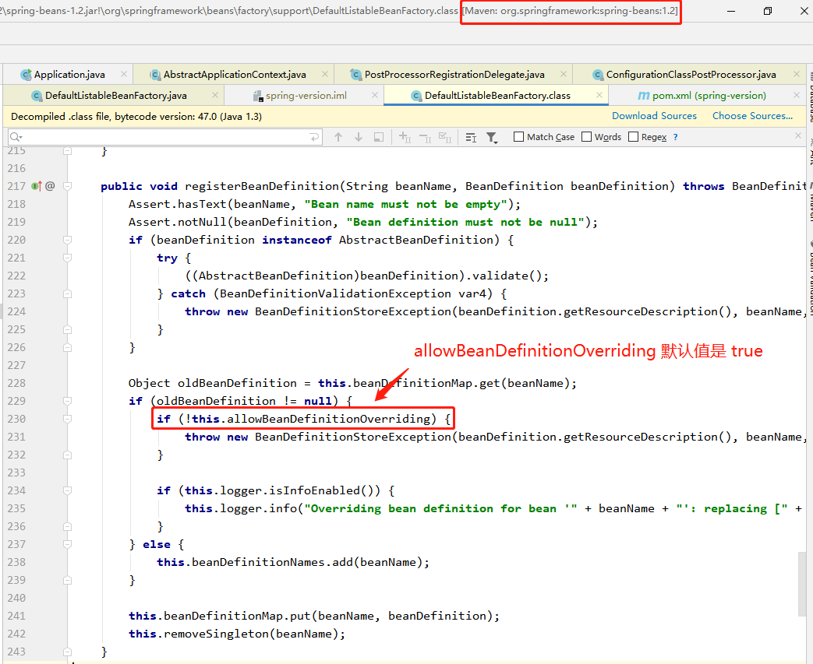

Spring 4.1.2 引进了 isAllowBeanDefinitionOverriding()方法

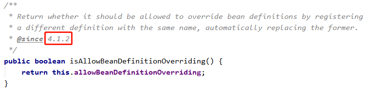

Spring 自始至终默认都是允许 BeanDefinition 覆盖的，变的是 Spring Boot ， Spring Boot 2.1.0 之前没有覆盖 Spring 的
allowBeanDefinitionOverriding 默认值，仍是允许 BeanDefinition 覆盖的

Spring Boot 2.1.0 中 SpringApplication 定义了私有属性：allowBeanDefinitionOverriding

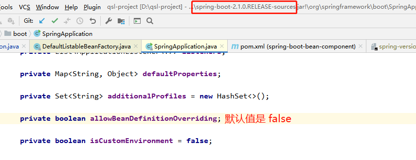

没有显示的指定值，那么默认值就是 false ，之后在 Spring Boot 启动过程中，会用此值覆盖掉 Spring 中的
allowBeanDefinitionOverriding 的默认值

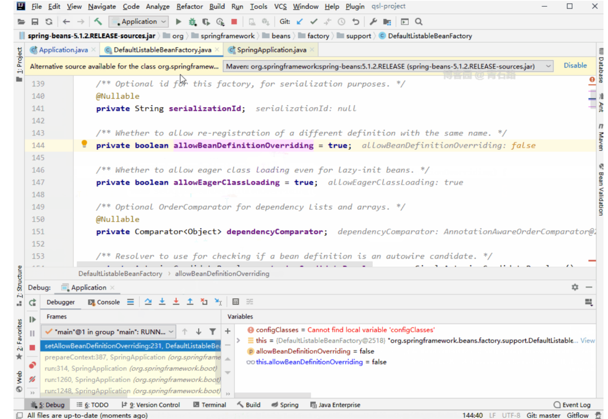

关于 allowBeanDefinitionOverriding ，我想大家应该已经清楚了